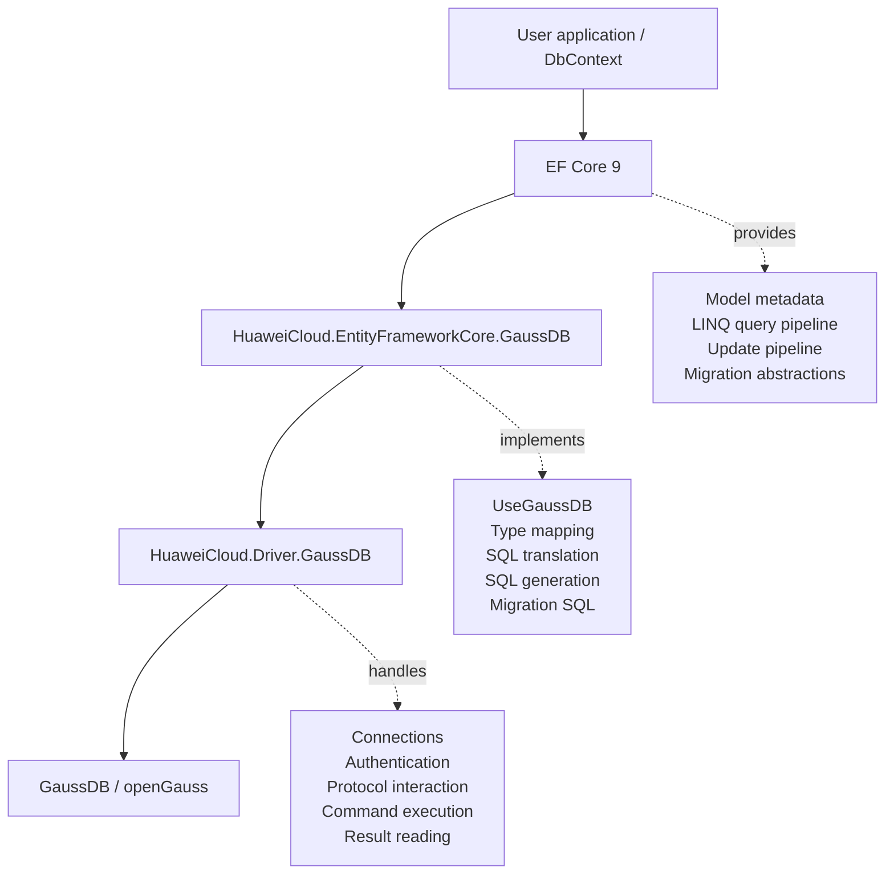

# GaussDB EFCore net9 Downgrade and Distributed Testing Adaptation Design

## 1. Document Scope

This document describes the design of the current repository on the `test_ctrl2net9` branch. The scope includes:

- Downgrading the GaussDB EF Core provider from the net10/EF10 control line to the net9/EF9 control line.
- Adapting provider extension points where EF9 and EF10 internal APIs differ.
- Preserving existing GaussDB provider SQL dialect and database behavior differences.
- Adding distributed database test controls so existing functional tests can run against a distributed database.
- Explaining how the test layer handles foreign keys, distributed tables, result ordering, and migrations baselines.

This document does not record real database hosts, accounts, passwords, local machine paths, or other sensitive information. Examples use placeholders such as `<repo-root>`, `<distributed-host-1>`, `<db-user>`, and `<db-password>`.

## 2. Relationship Between This Project and EF Core

This project is not EF Core itself. It is the database provider that connects EF Core to GaussDB/openGauss. It sits between EF Core and the GaussDB ADO.NET driver, translating EF Core models, queries, updates, and migration operations into SQL and database calls that GaussDB can execute.



| Layer | Representative components | Main responsibility | Impact in this change |
| --- | --- | --- | --- |
| User application layer | Business code, `DbContext`, entity classes | Uses EF Core APIs to express queries, updates, and migrations | Runtime target changes to `.NET 9.0` |
| EF Core framework layer | `Microsoft.EntityFrameworkCore`, `Relational` | Provides ORM abstractions, query pipeline, update pipeline, and model metadata | API boundary moves from EF10 to EF9 |
| GaussDB provider layer | `HuaweiCloud.EntityFrameworkCore.GaussDB` | Implements type mapping, SQL translation, SQL generation, and migration SQL | Must adapt to EF9 internal APIs |
| ADO.NET driver layer | `HuaweiCloud.Driver.GaussDB` | Connects to the database and executes commands | This EFCore repository does not modify driver protocol implementation |
| Database layer | GaussDB/openGauss | Executes SQL, stores data, and returns results | Distributed databases have FK and distribution-key capability limits |

## 3. Design Goals

1. Use `net9.0` as the unified target framework for the repository.
2. Use EF9-controlled versions for EF Core and Microsoft Extensions dependencies.
3. Adapt provider runtime code to EF9 internal APIs without faking EF10 internal types or EF10-only capabilities.
4. Preserve existing GaussDB provider behavior, such as the GaussDB SQL dialect, `DELETE ... USING ...` translation shape, and type mapping strategy.
5. Use EF9/Npgsql-expressible behavior as the test baseline reference instead of forcing net9 SQL text to match net10 SQL text.
6. Enable distributed testing only through an explicit switch, without affecting the centralized test path.
7. Allow existing tests to keep running on distributed databases where possible, isolating only hard database limitations or applying test-side DDL adaptation.

## 4. Non-Goals

1. Do not implement EF10-only ComplexType JSON or JSON partial update capabilities in the net9 provider.
2. Do not modify provider runtime behavior just to make SQL baselines exactly match net10.
3. Do not remove foreign keys or change table creation SQL by default in centralized tests.
4. Do not store real database hosts, accounts, or passwords in documents, examples, or test configuration.
5. Do not present distributed database limitations as centralized provider capabilities.

## 5. Project and Dependency Design

### 5.1 Target Framework

`Directory.Build.props` sets the unified target framework to:

```xml
<TargetFrameworks>net9.0</TargetFrameworks>
```

This is the entry point of the downgrade. The main provider, extension projects, and test projects all enter the net9 compilation path.

### 5.2 SDK and Dependency Versions

`global.json` pins the .NET SDK:

```json
{
  "sdk": {
    "version": "9.0.313",
    "rollForward": "latestMajor",
    "allowPrerelease": true
  }
}
```

`Directory.Packages.props` pins EF and extension package versions:

```xml
<EFCoreVersion>9.0.15</EFCoreVersion>
<MicrosoftExtensionsVersion>9.0.15</MicrosoftExtensionsVersion>
```

Design meaning:

- The provider references EF9 abstractions, interfaces, and internal APIs at compile time.
- Test projects and the provider use the same EF9 dependency set.
- A higher SDK may be used to build, but target framework and dependency behavior are controlled by net9/EF9.

## 6. Provider Runtime Code Design

### 6.1 Query Compilation Context Adaptation

Affected files:

- `src/EFCore.GaussDB/Query/Internal/GaussDBQueryCompilationContext.cs`
- `src/EFCore.GaussDB/Query/Internal/GaussDBQueryCompilationContextFactory.cs`

EF9's `RelationalQueryCompilationContext` constructor still requires the `nonNullableReferenceTypeParameters` argument. Normal queries do not have this set and pass `null`. Precompiled queries receive the set from the EF9 factory and pass it through to the base type.

Design meaning:

- Normal query behavior does not change.
- Precompiled queries preserve EF9 tracking information for non-nullable reference type parameters.
- This is an EF9 internal API adaptation and does not directly change the SQL generation strategy.

### 6.2 Parameter Access Adaptation During SQL Translation

Affected file:

- `src/EFCore.GaussDB/Query/Internal/GaussDBSqlTranslatingExpressionVisitor.cs`

EF10 code reads parameter values from `queryContext.Parameters`; in EF9 the corresponding member is `queryContext.ParameterValues`. The net9 code reads from `ParameterValues`.

This path is used to construct LIKE patterns for string queries such as `StartsWith`, `EndsWith`, and `Contains`:

- `null` parameters return `null`.
- Empty string parameters return `%`.
- Normal strings are escaped according to LIKE rules and then combined with `%`.

Design meaning: the code reads the same category of runtime parameter values, using the EF9 API name. It does not introduce new business semantics.

### 6.3 ExecuteDelete Translation Signature Adaptation

Affected file:

- `src/EFCore.GaussDB/Query/Internal/GaussDBQueryableMethodTranslatingExpressionVisitor.cs`

In EF9, `IsValidSelectExpressionForExecuteDelete` requires the provider to return the target `TableExpression` that can be deleted. The current code overrides the EF9 signature and keeps GaussDB/PostgreSQL-style `DELETE ... USING ...` support.

Design meaning:

- The signature is adapted to the EF9 base class.
- Behavior still allows later tables in the `SelectExpression` to be `InnerJoinExpression`.
- This lets the provider continue generating `DELETE FROM t USING other_table ...` shapes.

### 6.4 JSON Capability Boundary

EF9 does not support EF10's `ComplexProperty(...).ToJson()` configuration shape. Therefore net9 does not promise EF10-only ComplexType JSON query/shaping or partial update behavior.

net9 only promises JSON behavior expressible in EF9:

- Normal `JsonElement`/JSON DOM properties.
- Owned entity JSON models expressible in EF9.
- Existing GaussDB JSON functions and type mapping capabilities.

Design principles:

- Do not introduce custom EF10 placeholder types to simulate EF10 internal APIs.
- Do not hard-downgrade EF10-only tests into net9 runtime promises.
- Use EF9-expressible behavior as the test baseline.

### 6.5 Reverse Engineering of Serial Sequences

Affected file:

- `src/EFCore.GaussDB/Scaffolding/Internal/GaussDBDatabaseModelFactory.cs`

On distributed databases, serial sequence names may include database-generated suffixes. Detecting serial columns only by the traditional `${table}_${column}_seq` pattern is not stable. The current implementation uses `pg_depend` to locate the actual dependent sequence and then checks whether the default value references that sequence.

Design meaning:

- Reverse engineering can identify `SerialColumn` more reliably.
- This avoids migrations/scaffolding tests being blocked by sequence-name differences on distributed databases.
- It does not change explicitly configured user column types or value-generation strategies.

## 7. Distributed Testing Design

### 7.1 Explicit Switch

Affected file:

- `test/EFCore.GaussDB.FunctionalTests/TestUtilities/TestEnvironment.cs`

New configuration key:

```text
Test__GaussDB__IsDistributed=true
```

Tests enter the distributed adaptation path only when this switch is explicitly enabled. Centralized tests keep their default behavior.

### 7.2 Removing FK DDL During Table Creation

Affected file:

- `test/EFCore.GaussDB.FunctionalTests/TestUtilities/GaussDBTestStore.cs`

Distributed databases do not support the FK DDL used extensively by the test models. To avoid table creation failures blocking query, update, and migration tests that are unrelated to FKs, the distributed path:

- Removes inline FKs from `CreateTableOperation`.
- Removes standalone `AddForeignKeyOperation`.
- Removes FK-generated indexes that only serve FKs.
- Applies the same filtering to FK DDL in script initialization.

Design boundaries:

- Enabled only when `IsDistributed=true`.
- Centralized databases still create FKs through the original EF path.
- Tests that depend on database FK enforcement adjust their expectations to distributed no-FK enforcement.

### 7.3 Distributed Table Strategy

Distributed databases impose extra restrictions on distribution key types, unique constraints, and primary key shapes. For example, some types cannot be used as hash distribution keys. When needed, the test table creation logic appends:

```sql
DISTRIBUTE BY REPLICATION
```

Purpose of replicated tables:

- Avoid distributed DDL limits that are unrelated to the test target.
- Let existing EF functional tests continue validating query, update, and migration logic.
- Avoid affecting the centralized path.

### 7.4 Migrations SQL Baseline Adaptation

Affected file:

- `test/EFCore.GaussDB.FunctionalTests/Migrations/MigrationsNpgsqlTest.cs`

In the distributed path, the test `DistributedGaussDBMigrationsSqlGenerator`:

- Removes FK-related migration operations.
- Appends `DISTRIBUTE BY REPLICATION` to table creation SQL.
- Normalizes the distributed replication clause when asserting SQL baselines.

Design meaning:

- Tests still validate the main migration SQL.
- Distributed-only DDL is a test-environment adaptation and does not change the centralized baseline.
- FK DDL is a database capability boundary on distributed databases and is not treated as a net9 provider behavior regression.

### 7.5 Stabilizing Query Result Ordering

Distributed databases do not provide a stable physical return order. Some original tests combine `Skip`, `Take`, `FirstOrDefault`, or `Include` without an explicit `OrderBy`. Such tests may appear stable on centralized environments but produce drifting assertions on distributed environments.

The distributed path adds deterministic ordering to these cases, for example:

- `OrderBy(c => c.CustomerID)`
- `ThenBy(o => o.OrderID)`
- `OrderBy(g => g.Key)`

Design meaning:

- The tested LINQ capability category does not change.
- The selected rows become deterministic in distributed environments.
- Centralized tests still use the original base test implementation.

### 7.6 FK Enforcement Expectation Adjustment

Example affected files:

- `test/EFCore.GaussDB.FunctionalTests/StoreGeneratedFixupGaussDBTest.cs`
- `test/EFCore.GaussDB.FunctionalTests/Query/TPCInheritanceQueryGaussDBTest.cs`
- `test/EFCore.GaussDB.FunctionalTests/Query/TPHInheritanceQueryGaussDBTest.cs`
- `test/EFCore.GaussDB.FunctionalTests/Query/TPTInheritanceQueryGaussDBTest.cs`

In distributed mode:

```csharp
EnforcesFKs => !TestEnvironment.IsDistributed
EnforcesFkConstraints => !TestEnvironment.IsDistributed
```

Design meaning: tests explicitly acknowledge that distributed databases do not enforce FKs, instead of assuming that FK checks will happen in the database.

### 7.7 Known Distributed Execution Plan Boundary

`TPCRelationshipsQueryGaussDBTest` contains a small number of reverse include inheritance queries that hit a known execution plan boundary on real distributed databases. In distributed mode these tests return `Task.CompletedTask`; in centralized mode they still execute the original tests.

Design meaning:

- Only the confirmed distributed execution plan boundary is isolated.
- The skip scope is not expanded broadly.
- Centralized behavior validation is not affected.

## 8. Test Control Cases

New test control cases prevent accidental regressions:

| File | Purpose |
| --- | --- |
| `test/EFCore.GaussDB.Tests/Net9DowngradeControlTest.cs` | Verifies that target framework, EF version, test source exclusions, and precompiled query signatures remain controlled by EF9 |
| `test/EFCore.GaussDB.FunctionalTests/TestUtilities/GaussDBTestStoreTest.cs` | Verifies that the test connection string can explicitly enable or disable the `enable_extension` switch |

## 9. Acceptance Criteria

Basic acceptance:

- `EFCore.GaussDB.Tests` passes on net9.
- `EFCore.GaussDB.FunctionalTests` can run on a centralized database through the original path.
- `EFCore.GaussDB.FunctionalTests` can run fully on a distributed database when `IsDistributed=true` is explicitly set.

The latest distributed full-test reference result for this branch:

```text
total=14553
executed=13826
passed=13826
failed=0
skipped=727
```

This result is only a reference for the current branch state. Future verification should rely on the latest test output and TRX parsing result.
