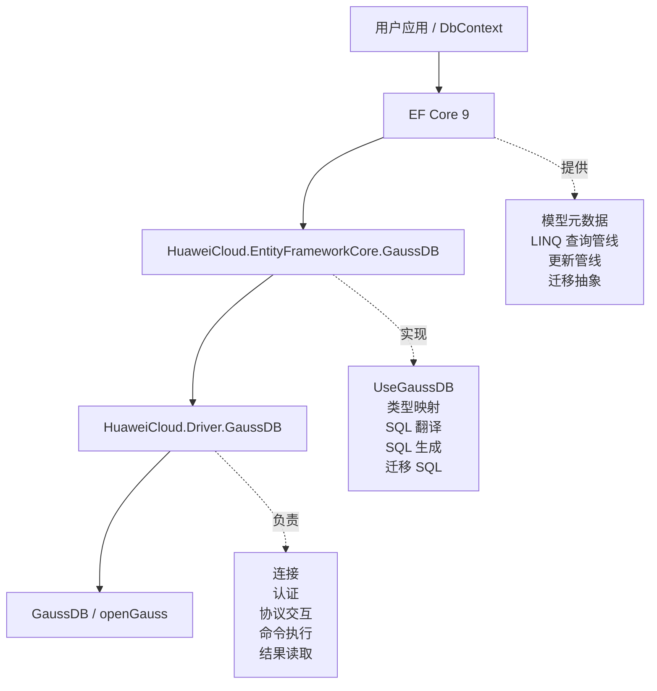

# GaussDB EFCore net9 降级与分布式测试适配设计文档

## 1. 文档范围

本文档描述当前仓库在 `test_ctrl2net9` 分支上的设计方案，范围包括：

- 将 GaussDB EF Core provider 从 net10/EF10 控制线降级到 net9/EF9 控制线。
- 适配 EF9 与 EF10 在 provider 内部扩展点上的 API 差异。
- 保留 GaussDB provider 既有 SQL 方言和数据库行为差异。
- 增加分布式数据库测试控制能力，使原有 functional 测试可在分布式库上执行。
- 说明测试侧对外键、分布式表、返回顺序和 migrations baseline 的处理原则。

本文档不记录真实数据库地址、账号、密码、本机路径等敏感信息。示例统一使用 `<repo-root>`、`<distributed-host-1>`、`<db-user>`、`<db-password>` 等占位符。

## 2. 当前项目与 EF Core 的关系

当前项目不是 EF Core 框架本身，而是 EF Core 面向 GaussDB/openGauss 的数据库 provider。它位于 EF Core 和 GaussDB ADO.NET 驱动之间，负责把 EF Core 上层表达的模型、查询、更新和迁移操作翻译成 GaussDB 可以执行的 SQL 与数据库调用。



| 层次 | 代表组件 | 主要职责 | 本次影响 |
| --- | --- | --- | --- |
| 用户应用层 | 业务代码、`DbContext`、实体类 | 调用 EF Core API 表达查询、更新、迁移 | 运行目标切换为 `.NET 9.0` |
| EF Core 框架层 | `Microsoft.EntityFrameworkCore`、`Relational` | 提供 ORM 抽象、查询管线、更新管线、模型元数据 | 从 EF10 API 边界降到 EF9 API 边界 |
| GaussDB provider 层 | `HuaweiCloud.EntityFrameworkCore.GaussDB` | 实现类型映射、SQL 翻译、SQL 生成、迁移 SQL | 需要适配 EF9 内部 API |
| ADO.NET 驱动层 | `HuaweiCloud.Driver.GaussDB` | 连接数据库并执行命令 | 本次 EFCore 仓库不修改驱动协议实现 |
| 数据库层 | GaussDB/openGauss | 执行 SQL、保存数据、返回结果 | 分布式库有 FK、分布式键等能力限制 |

## 3. 设计目标

1. 仓库目标框架统一为 `net9.0`。
2. EF Core 与 Microsoft Extensions 依赖统一为 EF9 控制版本。
3. provider 运行时代码适配 EF9 内部 API，不伪造 EF10 内部类型或 EF10-only 能力。
4. 保留 GaussDB provider 既有行为，例如 GaussDB SQL 方言、`DELETE ... USING ...` 翻译形态、类型映射策略。
5. 测试 baseline 参考 EF9/Npgsql 侧可表达行为，不强行要求 net9 SQL 文本等于 net10 SQL 文本。
6. 分布式测试通过显式开关启用，不影响集中式测试路径。
7. 分布式测试尽量让原有测试继续执行，仅对数据库硬限制做隔离或测试侧 DDL 适配。

## 4. 非目标

1. 不在 net9 provider 中实现 EF10-only 的 ComplexType JSON 或 JSON partial update 能力。
2. 不为了让 SQL baseline 与 net10 完全一致而反推修改 provider 运行时行为。
3. 不在集中式测试中默认移除外键或改变建表 SQL。
4. 不在文档、示例或测试配置中保存真实数据库地址、账号、密码。
5. 不把分布式数据库的能力限制伪装成 provider 的集中式能力。

## 5. 工程与依赖设计

### 5.1 目标框架

`Directory.Build.props` 将统一目标框架设置为：

```xml
<TargetFrameworks>net9.0</TargetFrameworks>
```

这个改动是降级入口，主 provider、扩展项目、测试项目都会进入 net9 编译路径。

### 5.2 SDK 与依赖版本

`global.json` 固定 .NET SDK：

```json
{
  "sdk": {
    "version": "9.0.313",
    "rollForward": "latestMajor",
    "allowPrerelease": true
  }
}
```

`Directory.Packages.props` 固定 EF 与扩展包版本：

```xml
<EFCoreVersion>9.0.15</EFCoreVersion>
<MicrosoftExtensionsVersion>9.0.15</MicrosoftExtensionsVersion>
```

设计含义：

- provider 编译时引用 EF9 的抽象、接口和内部 API。
- 测试项目与 provider 使用同一套 EF9 依赖。
- 允许使用较高 SDK 构建，但目标框架和依赖行为按 net9/EF9 控制。

## 6. Provider 运行时代码设计

### 6.1 查询编译上下文适配

涉及文件：

- `src/EFCore.GaussDB/Query/Internal/GaussDBQueryCompilationContext.cs`
- `src/EFCore.GaussDB/Query/Internal/GaussDBQueryCompilationContextFactory.cs`

EF9 的 `RelationalQueryCompilationContext` 构造函数仍需要 `nonNullableReferenceTypeParameters` 参数。普通查询没有该集合，传入 `null`；预编译查询由 EF9 factory 传入该集合，provider 继续向 base 传递。

设计含义：

- 普通查询行为不变。
- 预编译查询保留 EF9 对非空引用类型参数的跟踪信息。
- 这是 EF9 内部 API 适配，不直接改变 SQL 生成策略。

### 6.2 SQL 翻译阶段参数访问适配

涉及文件：

- `src/EFCore.GaussDB/Query/Internal/GaussDBSqlTranslatingExpressionVisitor.cs`

EF10 代码使用 `queryContext.Parameters` 读取参数值，EF9 对应成员是 `queryContext.ParameterValues`。当前 net9 代码改为从 `ParameterValues` 读取。

该路径用于 `StartsWith`、`EndsWith`、`Contains` 等字符串查询中构造 LIKE 模式：

- 参数为 `null` 时返回 `null`。
- 参数为空字符串时返回 `%`。
- 普通字符串会按 LIKE 规则转义后拼接 `%`。

设计含义：读取的是同一类“运行时参数值”，只是按 EF9 API 名称访问，不引入新的业务语义。

### 6.3 ExecuteDelete 翻译签名适配

涉及文件：

- `src/EFCore.GaussDB/Query/Internal/GaussDBQueryableMethodTranslatingExpressionVisitor.cs`

EF9 的 `IsValidSelectExpressionForExecuteDelete` 需要 provider 返回可删除的目标 `TableExpression`。当前代码按 EF9 签名 override，并继续保留 GaussDB/PostgreSQL 风格的 `DELETE ... USING ...` 支持。

设计含义：

- 签名按 EF9 base class 适配。
- 行为上仍允许 `SelectExpression` 后续表是 `InnerJoinExpression`。
- 这样 provider 可以继续生成 `DELETE FROM t USING other_table ...` 形态。

### 6.4 JSON 能力边界

EF9 不支持 EF10 的 `ComplexProperty(...).ToJson()` 配置形态，因此 net9 不承诺 EF10-only 的 ComplexType JSON query/shaping 或 partial update。

net9 只承诺 EF9 可表达的 JSON 行为：

- 普通 `JsonElement`/JSON DOM 属性。
- EF9 可表达的 owned entity JSON 模型。
- 既有 GaussDB JSON 函数和类型映射能力。

设计原则：

- 不引入 EF10 自定义占位类型来模拟 EF10 内部 API。
- 不把 EF10-only 测试用例硬降级成 net9 运行时承诺。
- 测试 baseline 以 EF9 可表达行为为准。

### 6.5 反向工程 serial 序列识别

涉及文件：

- `src/EFCore.GaussDB/Scaffolding/Internal/GaussDBDatabaseModelFactory.cs`

分布式库上 serial 序列名可能带有数据库内部生成的后缀，仅按传统 `${table}_${column}_seq` 拼接无法稳定识别。当前实现通过 `pg_depend` 找到真实依赖序列，再判断默认值是否引用该序列。

设计含义：

- 反向工程时能更可靠地识别 `SerialColumn`。
- 解决分布式库上 migrations/scaffolding 测试被序列名差异挡住的问题。
- 不改变用户显式配置的列类型或值生成策略。

## 7. 分布式测试设计

### 7.1 显式开关

涉及文件：

- `test/EFCore.GaussDB.FunctionalTests/TestUtilities/TestEnvironment.cs`

新增配置项：

```text
Test__GaussDB__IsDistributed=true
```

只有显式启用该开关时，测试才进入分布式适配路径。集中式测试默认行为不变。

### 7.2 建表阶段移除 FK

涉及文件：

- `test/EFCore.GaussDB.FunctionalTests/TestUtilities/GaussDBTestStore.cs`

分布式数据库不支持测试模型里大量使用的 FK DDL。为了避免“建表失败”挡住与 FK 无关的查询、更新、迁移测试，分布式路径会：

- 从 `CreateTableOperation` 中移除 inline FK。
- 移除独立的 `AddForeignKeyOperation`。
- 移除由 FK 生成、仅服务 FK 的索引。
- 对脚本初始化中的 FK DDL 做同样过滤。

设计边界：

- 只在 `IsDistributed=true` 时启用。
- 集中式库仍按原始 EF 创建外键。
- 依赖数据库 FK enforcement 的测试会将期望调整为分布式不强制 FK。

### 7.3 分布式表策略

分布式库对分布键类型、唯一约束、主键形态有额外限制。例如部分类型不能作为 hash 分布键。测试建表逻辑在必要时追加：

```sql
DISTRIBUTE BY REPLICATION
```

使用复制表的目的：

- 避免与测试目标无关的分布式 DDL 限制挡住用例。
- 让原有 EF functional 测试尽量继续验证查询、更新、迁移逻辑。
- 不影响集中式路径。

### 7.4 Migrations SQL baseline 适配

涉及文件：

- `test/EFCore.GaussDB.FunctionalTests/Migrations/MigrationsNpgsqlTest.cs`

分布式路径下，测试用 `DistributedGaussDBMigrationsSqlGenerator` 会：

- 移除 FK 相关 migration operation。
- 给建表 SQL 追加 `DISTRIBUTE BY REPLICATION`。
- 在断言 SQL baseline 时归一化分布式追加的复制分布语句。

设计含义：

- 测试仍验证 migrations 生成主干 SQL。
- 分布式专用 DDL 只是测试环境适配，不反推集中式 baseline。
- FK DDL 在分布式库上是数据库能力边界，不作为 provider net9 行为回归。

### 7.5 查询结果顺序稳定化

分布式数据库没有稳定物理返回顺序。原测试中部分 `Skip`、`Take`、`FirstOrDefault`、`Include` 组合在没有明确 `OrderBy` 时，集中式环境可能碰巧稳定，分布式环境会出现断言漂移。

分布式路径对这类测试补充确定性排序，例如：

- `OrderBy(c => c.CustomerID)`
- `ThenBy(o => o.OrderID)`
- `OrderBy(g => g.Key)`

设计含义：

- 不改变被测 LINQ 能力类别。
- 只让“取哪几行”在分布式环境下确定。
- 集中式测试仍走原始基类用例。

### 7.6 FK enforcement 期望调整

涉及文件示例：

- `test/EFCore.GaussDB.FunctionalTests/StoreGeneratedFixupGaussDBTest.cs`
- `test/EFCore.GaussDB.FunctionalTests/Query/TPCInheritanceQueryGaussDBTest.cs`
- `test/EFCore.GaussDB.FunctionalTests/Query/TPHInheritanceQueryGaussDBTest.cs`
- `test/EFCore.GaussDB.FunctionalTests/Query/TPTInheritanceQueryGaussDBTest.cs`

分布式下：

```csharp
EnforcesFKs => !TestEnvironment.IsDistributed
EnforcesFkConstraints => !TestEnvironment.IsDistributed
```

设计含义：测试明确承认分布式库不强制 FK，而不是让测试误以为数据库会执行 FK 检查。

### 7.7 已识别的分布式执行计划边界

`TPCRelationshipsQueryGaussDBTest` 中少量 reverse include 继承查询在真实分布式执行计划下存在边界，分布式路径返回 `Task.CompletedTask`，集中式路径仍执行原测试。

设计含义：

- 只隔离已确认的分布式执行计划边界。
- 不扩大 skip 范围。
- 不影响集中式行为验证。

## 8. 测试控制用例

新增测试控制用例用于防止后续误改：

| 文件 | 目的 |
| --- | --- |
| `test/EFCore.GaussDB.Tests/Net9DowngradeControlTest.cs` | 验证仓库目标框架、EF 版本、测试源码排除规则和预编译查询签名仍按 EF9 控制 |
| `test/EFCore.GaussDB.FunctionalTests/TestUtilities/GaussDBTestStoreTest.cs` | 验证测试连接串中的 `enable_extension` 开关可显式打开或关闭 |

## 9. 验收标准

基础验收：

- `EFCore.GaussDB.Tests` 在 net9 下通过。
- `EFCore.GaussDB.FunctionalTests` 在集中式库上可按原路径执行。
- `EFCore.GaussDB.FunctionalTests` 在显式 `IsDistributed=true` 的分布式库上可全量执行。

本分支最近一次分布式全量验证结果：

```text
total=14553
executed=13826
passed=13826
failed=0
skipped=727
```

该结果只作为分支当前状态参考；后续以最新测试输出和 TRX 解析结果为准。
